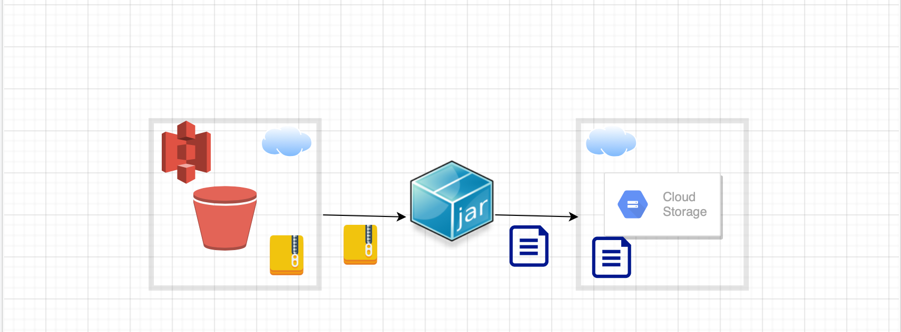

= Spring Boot Cloud Batch Application

This batch application uses https://cloud.spring.io/spring-cloud-aws/reference/html/#using-amazon-web-services[Spring Cloud for Amazon Web Services] to download zip files from AWS S3 bucket, unzips them and
uploads contents to Google Cloud Storage (GCS) using https://googlecloudplatform.github.io/spring-cloud-gcp/2.0.1/reference/html/index.html[Spring Cloud GCP]



Spring Boot Cloud Batch Application performs the following steps.
```
1. Checks AWS S3 bucket for the presence of zip files
2. If zip files are found on S3 bucket,
2a. For the oldest zip file, unzip & transfer zip contents to destination GCS Bucket.
2b. Delete the zip file.
3. Repeat above steps after a scheduled interval.
```


=  Configuration

application.yaml in resources folder has AWS S3 bucket & GCP storage configuration properties and location of source/destination folders to download and upload files.

Sensitive property (password, keys etc.) values are encrypted & decrypted through https://github.com/ulisesbocchio/jasypt-spring-boot[jasypt-spring-boot]  and http://www.jasypt.org/cli.html[Jasypt]

= Build
$ mvn clean package spring-boot:repackage

= Run
$ java -jar target/spring-boot-cloud-batch-sample-1.0-SNAPSHOT.jar


